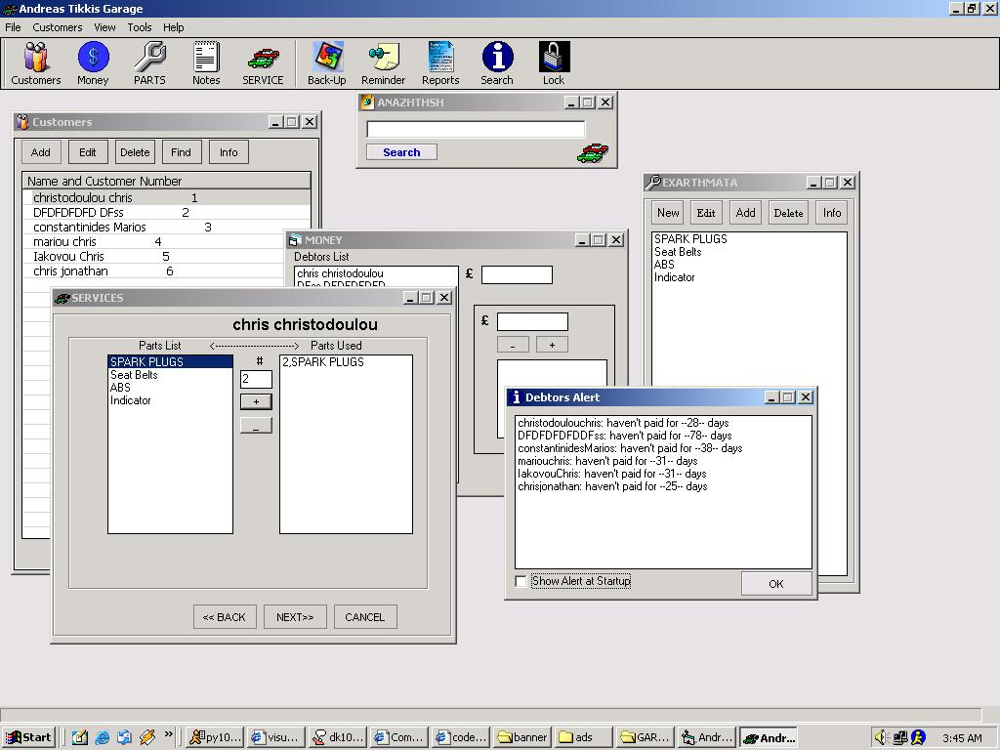



## A Garage DB and Inventory system

### Description

Complete application. Customers Database, inventory system, search databse records, cool gui, Debtors alert, password protected.

This application is suitable for a car shop. Whenever the mechanic finish a job on a car the only thing he has to do is to use the service wizard and select the parts he used from a list and the number of the parts. The application substract the number of parts used from the inventory and gives the subtotal and total price.

(The login password is set to nothing for the moment so if you want to access the application just click the login button)
 
### More Info
 

             |
---                |---
**Submitted On**   |2001-11-04 14:08:40
**By**             |[Tolinio Christodoulou](https://github.com/Planet-Source-Code/PSCIndex/blob/master/ByAuthor/tolinio-christodoulou.md)
**Level**          |Intermediate
**User Rating**    |4.7 (159 globes from 34 users)
**Compatibility**  |VB 5\.0, VB 6\.0
**Category**       |[Databases/ Data Access/ DAO/ ADO](https://github.com/Planet-Source-Code/PSCIndex/blob/master/ByCategory/databases-data-access-dao-ado__1-6.md)
**World**          |[Visual Basic](https://github.com/Planet-Source-Code/PSCIndex/blob/master/ByWorld/visual-basic.md)
**Archive File**   |[A\_Garage\_D333351152001\.zip](https://github.com/Planet-Source-Code/tolinio-christodoulou-a-garage-db-and-inventory-system__1-28610/archive/master.zip)

